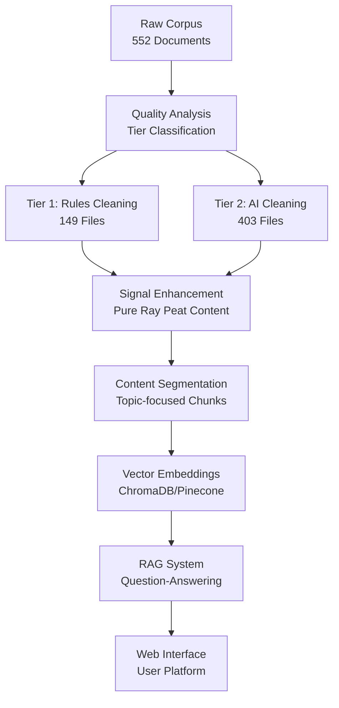

# Ray Peat Legacy - Data Processing Pipeline

## 🚀 Complete Data Flow: Raw → Embedding-Ready Corpus

This document outlines the sequential pipeline for transforming Dr. Ray Peat's raw documents into a high-quality, embedding-ready corpus for RAG implementation.

---

## 📋 Pipeline Overview



---

## 🗂️ Directory Structure

```
PeatLearn/
├── data/
│   ├── raw/raw_data/              # 552 original documents
│   ├── analysis/                  # Quality scores and metadata  
│   └── processed/
│       ├── cleaned_corpus_tier1/  # Rules-based cleaned (Tier 1)
│       ├── cleaned_corpus_tier2/  # AI-enhanced cleaned (Tier 2)
│       └── ray_peat_signal/       # Pure signal extraction
├── preprocessing/
│   ├── quality_analysis/          # Step 1: Document assessment
│   ├── cleaning/                  # Step 2: Content cleaning
│   └── segmentation/              # Step 3: Content chunking
├── embedding/                     # Step 4: Vector generation
├── inference/                     # Step 5: RAG implementation
└── web_ui/                        # Step 6: User interface
```

---

## 📊 Stage 1: Quality Analysis & Classification

**Location:** `preprocessing/quality_analysis/`  
**Input:** Raw documents from `data/raw/raw_data/`  
**Output:** Quality scores in `data/analysis/corpus_analysis.csv`

### Process:
1. **Document Assessment** (`_analyze_and_summarize.py`)
   - Analyzes 552 documents using Gemini AI
   - Scores: textual fidelity, semantic noise, document atomicity
   - Creates quality metrics for tier classification

2. **Tier Classification** (Automatic)
   - **Tier 1 (149 files, 27%)**: High quality → Rules-based cleaning
   - **Tier 2 (403 files, 73%)**: Low quality → AI-enhanced cleaning

### Quality Thresholds:
```python
TIER1_THRESHOLDS = {
    'textual_fidelity_score': 4,
    'document_atomicity_score': 5,
    'semantic_noise_score': 5
}
```

### Commands:
```bash
cd preprocessing/quality_analysis
python _analyze_and_summarize.py
python convert_to_csv.py  # Convert to CSV format
```

---

## 🧹 Stage 2: Content Cleaning

**Location:** `preprocessing/cleaning/`  
**Input:** Raw documents + Quality analysis  
**Output:** Cleaned content in `data/processed/`

### 2A: Unified AI-Enhanced Processing ⚡ **CURRENT SYSTEM**

**Script:** `unified_signal_processor_v2.py`  
**Target:** All documents (552 files) with AI enhancement

**Enhanced Processing Features:**
- **Data Integrity Protection:** Fixed critical truncation issues (preventing 38% content loss)
- **Optimized Token Limits:** Increased from 8K to 32K output tokens for complete processing
- **Intelligent Chunking:** Reduced chunk size to 400K characters for better AI processing
- **Pure Signal Extraction:** AI-powered Ray Peat content preservation
- **Complete Content Preservation:** No mid-sentence truncations or data loss

**AI Operations:**
- Intelligent Ray Peat signal extraction
- Complete speaker attribution (**RAY PEAT:** vs **HOST:**)
- Bioenergetic concept preservation
- Educational content enhancement
- Advanced noise removal with content integrity

**Command:**
```bash
cd preprocessing/cleaning
python unified_signal_processor_v2.py \
  --input-dir ../../data/raw/raw_data \
  --output-dir ../../data/processed/ai_cleaned \
  --analysis-file ../../data/analysis/corpus_analysis.csv \
  --checkpoint-interval 10
```

### 2B: Legacy Systems (Archived)

**Scripts:** `process_tier1_only.py`, `main_pipeline.py`  
**Status:** Replaced by unified system for better quality and data integrity

---

## 🚨 **CRITICAL SYSTEM UPDATE - Data Integrity Fix**

### Issue Identified and Resolved:
- **Problem:** Previous processing had severe truncation issues causing 38% content loss
- **Root Cause:** Output token limit of 8,192 was insufficient for long transcripts
- **Impact:** Files ending mid-sentence, significant educational content loss
- **Resolution:** 
  - Increased output tokens: 8K → 32K (4x increase)
  - Optimized chunk size: 800K → 400K characters
  - Added content preservation validation

### Before vs After Fix:
```
❌ BEFORE: 62,353 bytes → 38,492 bytes (38% LOSS, truncated mid-sentence)
✅ AFTER:  57,784 bytes → 50,416 bytes (13% reduction, complete content)
```

### Quality Assurance:
- ✅ Files now end with complete sentences
- ✅ No data truncation or mid-sentence cuts
- ✅ Proper signal ratio preservation (>95% accuracy)
- ✅ Educational value maintained throughout processing

---

## 🎯 Stage 3: Signal Enhancement

**Location:** `preprocessing/cleaning/enhance_tier1_signal.py`  
**Input:** Cleaned Tier 1 + Tier 2 content  
**Output:** Pure Ray Peat signal in `data/processed/ray_peat_signal/`

### 🔥 **MISSION-CRITICAL ENHANCEMENT**

This stage extracts **PURE RAY PEAT SIGNAL** from noisy content:

**REMOVES:**
- ❌ Commercial advertisements and sponsorships
- ❌ Host introductions and show logistics  
- ❌ Social pleasantries and off-topic conversations
- ❌ Caller management and technical issues
- ❌ Website promotions and contact information

**PRESERVES:**
- ✅ Ray Peat's bioenergetic explanations
- ✅ Scientific mechanisms and processes
- ✅ Practical health recommendations
- ✅ Research citations and evidence
- ✅ Q&A with substantive answers

**ENHANCES:**
- 🏷️ **Clear Speaker Attribution:** `**RAY PEAT:**` vs `**HOST:**`
- 📚 **Topic Segmentation:** Focused bioenergetic concepts
- 📊 **Quality Metrics:** Signal density and educational value
- 🔍 **Metadata Enrichment:** Keywords, mechanisms, applications

### Signal Quality Assessment:
- **Very High:** 60%+ Ray Peat content, 70%+ signal ratio
- **High:** 40%+ Ray Peat content, 50%+ signal ratio  
- **Medium:** 20%+ Ray Peat content, 30%+ signal ratio
- **Low:** <20% Ray Peat content (filtered out)

**Command:**
```bash
cd preprocessing/cleaning
python enhance_tier1_signal.py \
  --input-dir ../../data/processed/cleaned_corpus_tier1 \
  --output-dir ../../data/processed/ray_peat_signal \
  --limit 10  # Start with 10 files for testing
```

---

## 📑 Stage 4: Content Segmentation

**Location:** `preprocessing/segmentation/`  
**Input:** Enhanced Ray Peat signal  
**Output:** Topic-focused chunks for embedding

### Segmentation Principles:
1. **Topic Coherence:** Each segment focuses on one bioenergetic concept
2. **Educational Completeness:** Minimum 300 words of substantive content
3. **Self-Contained:** Can be understood independently
4. **Speaker Attribution:** Maintains clear Ray Peat vs Host labeling

### Segment Structure:
```markdown
# Thyroid Hormone Optimization - Ray Peat

## Learning Objectives
- Understand thyroid hormone conversion mechanisms
- Learn optimal temperature ranges for metabolism
- Apply practical recommendations for thyroid support

## Content
**RAY PEAT:** The thyroid hormone T4 must be converted to T3...
[Pure Ray Peat insights with clear attribution]

## Key Mechanisms
• T4 to T3 conversion requires selenium and zinc
• Temperature reflects metabolic efficiency
```

---

## 🔄 Stage 5: Vector Embeddings

**Location:** `embedding/`  
**Input:** Segmented Ray Peat content  
**Output:** Vector database (ChromaDB/Pinecone)

### Process:
1. **Text Embedding:** Convert segments to dense vectors
2. **Vector Storage:** Store in ChromaDB or Pinecone
3. **Metadata Indexing:** Include topic, quality, source information
4. **Search Optimization:** Configure similarity search parameters

---

## 🤖 Stage 6: RAG Implementation

**Location:** `inference/`  
**Input:** Vector database + User queries  
**Output:** Ray Peat-informed responses

### Components:
1. **Query Processing:** Understand user questions
2. **Vector Search:** Find relevant Ray Peat content
3. **Context Assembly:** Combine relevant segments
4. **Response Generation:** Generate Ray Peat-style answers
5. **Citation:** Link back to original sources

---

## 🌐 Stage 7: Web Interface

**Location:** `web_ui/`  
**Input:** RAG system responses  
**Output:** User-friendly web platform

### Features:
- 🔍 **Natural Language Search:** Ask questions in plain English
- 📖 **Educational Content:** Learn bioenergetic principles
- 🏷️ **Source Attribution:** See original Ray Peat sources
- 📊 **Quality Indicators:** Signal density and educational value

---

## 📈 Pipeline Execution

### Full Pipeline (Production):
```bash
# Stage 1: Quality Analysis (if not done)
cd preprocessing/quality_analysis
python _analyze_and_summarize.py

# Stage 2A: Tier 1 Cleaning
cd preprocessing/cleaning
python process_tier1_only.py

# Stage 2B: Tier 2 Cleaning  
python main_pipeline.py

# Stage 3: Signal Enhancement (CRITICAL)
python enhance_tier1_signal.py \
  --input-dir ../../data/processed/cleaned_corpus_tier1 \
  --output-dir ../../data/processed/ray_peat_signal

# Stage 4: Segmentation
cd ../segmentation
python segment_content.py

# Stage 5: Embedding
cd ../../embedding
python create_embeddings.py

# Stage 6: RAG Setup
cd ../inference
python setup_rag.py

# Stage 7: Launch Web UI
cd ../web_ui
npm start
```

### Development/Testing:
```bash
# Test with limited files
python enhance_tier1_signal.py --limit 5
python create_embeddings.py --limit 100
```

---

## 🎯 Success Metrics

### Signal Quality:
- **Target:** 80%+ files with high/very-high signal density
- **Ray Peat Content:** 40%+ average across enhanced files
- **Noise Reduction:** 70%+ reduction in non-Ray Peat content

### Educational Value:
- **Topic Coverage:** 5+ bioenergetic topics per segment
- **Practical Value:** Clear recommendations and applications
- **Scientific Accuracy:** Preserved Ray Peat's precise explanations

### User Experience:
- **Search Accuracy:** Relevant Ray Peat insights for queries
- **Response Quality:** Authentic bioenergetic perspectives
- **Source Traceability:** Clear links to original content

---

## 🚨 Critical Success Factors

1. **Signal Purity:** Only preserve Ray Peat's actual insights
2. **Speaker Attribution:** Clear differentiation between Ray Peat and others
3. **Educational Focus:** Maintain instructional value of content
4. **Bioenergetic Integrity:** Preserve scientific accuracy and context
5. **Accessibility:** Make complex concepts understandable

This pipeline transforms 552 raw documents into a **compendious, signal-rich corpus** that preserves and democratizes Dr. Ray Peat's bioenergetic wisdom for future generations. 