# In Memoriam: Dr. Raymond## 🧬 The Bioenergetic Revolution: Core Principles

Dr. Peat's bioenergetic theory## 🎓 How PeatLearn Honors This Legacy

PeatLear---

# 🏗️ PeatLearn: Technical Architecture Deep Dive

*Advanced AI-Powered Learning Platform for Ray Peat's Bioenergetic Knowledge*

## 🎯 System Overview

PeatLearn represents a state-of-the-art implementation of modern AI techniques applied to educational technology. Our platform combines **Retrieval-Augmented Generation (RAG)**, **adaptive learning algorithms**, and **advanced personalization** to create an unparalleled learning experience.

### 🚀 Core Technologies

- **Backend Framework**: FastAPI for high-performance, async API services
- **AI/ML Stack**: Gemini 2.5 Flash Lite, Pinecone vector database, advanced embeddings
- **Frontend**: Streamlit for rapid development, custom CSS for enhanced UX
- **Database**: SQLite for user data, Pinecone for semantic search
- **Deployment**: Docker containerization, scalable microservice architecture

## 🔍 Retrieval-Augmented Generation (RAG) System

Our RAG implementation represents the heart of PeatLearn's question-answering capabilities, ensuring responses are always grounded in Dr. Peat's authentic writings.

### 📊 Vector Database Architecture

**Pinecone Integration:**
```python
# High-performance vector search with semantic understanding
class PineconeVectorSearch:
    def __init__(self, index_name="ray-peat-corpus"):
        self.index = pinecone.Index(index_name)
        self.embedding_model = "text-embedding-3-small"  # OpenAI
        
    async def search(self, query: str, top_k: int = 10):
        # Generate query embedding
        query_vector = await self.get_embedding(query)
        
        # Semantic search in Pinecone
        results = self.index.query(
            vector=query_vector,
            top_k=top_k,
            include_metadata=True
        )
        
        return [SearchResult.from_pinecone(r) for r in results.matches]
```

**Corpus Processing Pipeline:**
1. **Document Segmentation**: Intelligent chunking of Ray Peat's writings
2. **Embedding Generation**: High-dimensional vector representations
3. **Metadata Enrichment**: Topic classification, source attribution, quality scoring
4. **Index Optimization**: Efficient retrieval with semantic similarity

### 🤖 LLM Integration & Response Generation

**Gemini 2.5 Flash Lite Configuration:**
```python
# Optimized for speed, accuracy, and cost-effectiveness
class RAGResponseGenerator:
    def __init__(self):
        self.model = "gemini-2.5-flash"
        self.max_tokens = 2048
        self.temperature = 0.3  # Balanced creativity/consistency
        
    async def generate_response(self, query: str, context: List[SearchResult]):
        prompt = self.build_rag_prompt(query, context)
        
        response = await self.gemini_client.generate_content(
            prompt,
            generation_config={
                "temperature": self.temperature,
                "max_output_tokens": self.max_tokens,
                "candidate_count": 1
            }
        )
        
        return self.parse_response(response)
```

### 🎯 Advanced Search Features

**Multi-stage Retrieval:**
1. **Initial Vector Search**: Semantic similarity matching
2. **Reranking Algorithm**: Relevance scoring based on query intent
3. **Source Diversification**: Ensuring breadth across Ray Peat's corpus
4. **Context Optimization**: Intelligent chunk selection and merging

**Search Quality Metrics:**
- **Relevance Scoring**: Cosine similarity + contextual relevance
- **Source Attribution**: Complete citation tracking
- **Response Confidence**: Uncertainty quantification
- **Latency Optimization**: <500ms average response time

## 🧠 Adaptive Learning Engine

PeatLearn's adaptive learning system employs sophisticated psychometric models to optimize the learning experience for each individual user.

### 📈 Item Response Theory (IRT) Implementation

**Mathematical Foundation:**
```python
# Core IRT equations for adaptive assessment
def expected_correctness(ability_theta, difficulty_b):
    """
    Calculate expected probability of correct response
    θ (theta): User ability parameter
    b: Item difficulty parameter
    """
    return 1 / (1 + np.exp(-1.7 * (ability_theta - difficulty_b)))

def update_ability(theta, observed, expected, learning_rate=0.15):
    """Update user ability based on response"""
    return theta + learning_rate * (observed - expected)

def update_difficulty(b, observed, expected, learning_rate=0.07):
    """Update item difficulty based on user responses"""
    return b + learning_rate * (expected - observed)
```

**Adaptive Assessment Features:**
- **Real-time Ability Estimation**: Continuous θ (theta) parameter updates
- **Dynamic Difficulty Adjustment**: Optimal challenge level maintenance
- **Multi-topic Modeling**: Separate ability tracking per knowledge domain
- **Performance Analytics**: Detailed learning trajectory analysis

### 🎲 Quiz Generation System

**AI-Powered Question Creation:**
```python
class AdaptiveQuizGenerator:
    def __init__(self):
        self.llm_client = GeminiClient("gemini-2.5-flash")
        self.rag_system = PineconeRAG()
        
    async def generate_quiz_items(self, topics: List[str], target_difficulty: float):
        # Retrieve relevant passages
        passages = await self.rag_system.search_topics(topics)
        
        # Generate MCQs with specific difficulty targeting
        prompt = self.build_mcq_prompt(passages, target_difficulty)
        
        items = await self.llm_client.generate_structured_output(
            prompt,
            output_schema=QuizItemSchema
        )
        
        return [self.calibrate_difficulty(item) for item in items]
```

**Question Quality Assurance:**
- **Semantic Validation**: Ensuring questions accurately reflect source material
- **Difficulty Calibration**: Statistical validation of item parameters
- **Distractor Analysis**: High-quality incorrect answer options
- **Content Alignment**: Questions directly tied to learning objectives

## 🔄 Personalization & Recommendation Engine

### 🎯 Neural Collaborative Filtering

**Advanced ML Personalization:**
```python
class NeuralCollaborativeFiltering:
    def __init__(self, embedding_dim=64):
        self.user_embedding = nn.Embedding(num_users, embedding_dim)
        self.content_embedding = nn.Embedding(num_content, embedding_dim)
        self.neural_network = nn.Sequential(
            nn.Linear(embedding_dim * 2, 128),
            nn.ReLU(),
            nn.Dropout(0.2),
            nn.Linear(128, 64),
            nn.ReLU(),
            nn.Linear(64, 1),
            nn.Sigmoid()
        )
    
    def forward(self, user_id, content_id):
        user_vec = self.user_embedding(user_id)
        content_vec = self.content_embedding(content_id)
        x = torch.cat([user_vec, content_vec], dim=1)
        return self.neural_network(x)
```

**Personalization Features:**
- **Learning Style Detection**: Automatic identification of user preferences
- **Content Recommendation**: ML-driven suggestion system
- **Difficulty Optimization**: Personalized challenge calibration
- **Progress Prediction**: Forecasting learning outcomes

### 📊 Real-time Analytics Dashboard

**User Performance Tracking:**
```python
class LearningAnalytics:
    def __init__(self):
        self.db = SQLiteManager("user_interactions.db")
        self.analytics_engine = AdvancedAnalyticsEngine()
    
    async def generate_user_report(self, user_id: str):
        # Aggregate user interaction data
        interactions = await self.db.get_user_interactions(user_id)
        
        # Calculate key metrics
        metrics = {
            "average_mastery": self.calculate_mastery_score(interactions),
            "learning_velocity": self.calculate_velocity(interactions),
            "preferred_difficulty": self.estimate_preferred_difficulty(interactions),
            "topic_strengths": self.analyze_topic_performance(interactions),
            "improvement_suggestions": self.generate_recommendations(interactions)
        }
        
        return metrics
```

## 🚦 API Architecture & Endpoints

### 🎪 Service Architecture

**Microservice Design:**
```
┌─────────────────────────────────────────────────┐
│                Frontend Layer                    │
├─────────────────────────────────────────────────┤
│  Streamlit UI (Port 8501)                      │
│  Custom CSS/JS Components                       │
└─────────────────────────────────────────────────┘
                        │
┌─────────────────────────────────────────────────┐
│                API Gateway                       │
├─────────────────────────────────────────────────┤
│  Load Balancing                                 │
│  Rate Limiting                                  │
│  Authentication                                 │
└─────────────────────────────────────────────────┘
                        │
        ┌───────────────┼───────────────┐
        │               │               │
┌───────▼─────┐ ┌───────▼─────┐ ┌───────▼─────┐
│   RAG API   │ │Advanced ML  │ │ Analytics   │
│ (Port 8000) │ │ (Port 8001) │ │ Service     │
├─────────────┤ ├─────────────┤ ├─────────────┤
│• Q&A System │ │• Adaptive   │ │• User Metrics│
│• Search     │ │  Learning   │ │• Reports    │
│• Citations  │ │• Quiz Gen   │ │• Insights   │
└─────────────┘ └─────────────┘ └─────────────┘
        │               │               │
        └───────────────┼───────────────┘
                        │
┌─────────────────────────────────────────────────┐
│              Data Layer                         │
├─────────────────────────────────────────────────┤
│  Pinecone Vector DB  │  SQLite Analytics DB    │
│  Ray Peat Corpus     │  User Interactions      │
└─────────────────────────────────────────────────┘
```

### 🔌 Key API Endpoints

**RAG Service (Port 8000):**
```python
# Q&A with source attribution
@app.post("/api/rag/ask")
async def ask_question(request: QuestionRequest):
    response = await rag_system.answer_question(
        request.question,
        max_sources=request.max_sources,
        min_similarity=request.min_similarity
    )
    return RAGResponseModel.from_rag_response(response)

# Vector search
@app.get("/api/search")
async def search_corpus(q: str, limit: int = 10):
    results = await vector_search.search(q, top_k=limit)
    return {"results": [r.to_dict() for r in results]}
```

**Advanced ML Service (Port 8001):**
```python
# Adaptive quiz session
@app.post("/api/quiz/session/start")
async def start_quiz_session(request: QuizSessionStart):
    session = await quiz_engine.create_session(
        user_id=request.user_id,
        topics=request.topics,
        num_questions=request.num_questions
    )
    return {"session_id": session.id, "first_item": session.next_item()}

# Process quiz answer with IRT updates
@app.post("/api/quiz/answer")
async def submit_answer(request: QuizAnswer):
    result = await quiz_engine.process_answer(
        session_id=request.session_id,
        item_id=request.item_id,
        chosen_index=request.chosen_index
    )
    
    # Update user ability and item difficulty
    await adaptive_engine.update_parameters(result)
    
    return {"correct": result.correct, "next_item": result.next_item}

# Personalized recommendations
@app.get("/api/personalization/recommendations/{user_id}")
async def get_recommendations(user_id: str, num_recommendations: int = 5):
    recs = await personalization_engine.generate_recommendations(
        user_id, num_recommendations
    )
    return {"recommendations": recs}
```esents a revolutionary approach to preserving and sharing Dr. Ray Peat's profound insights. By combining cutting-edge AI technology with his timeless wisdom, we've created an interactive learning platform that makes complex bioenergetic concepts accessible to everyone.

### 📚 For Learners: Your Personal Ray Peat Mentor

**🔍 Intelligent Q&A System**
- Ask any question about metabolism, hormones, nutrition, or health
- Receive comprehensive answers backed by Ray Peat's original writings
- Get direct citations and source references for further exploration
- Access both simple explanations and detailed scientific rationale

**🎯 Adaptive Learning Experience**
- Take personalized quizzes that adjust to your current knowledge level
- Track your understanding across different bioenergetic topics
- Receive targeted recommendations based on your learning patterns
- Build mastery progressively with scientifically-optimized difficulty curves

**📊 Progress Analytics**
- Monitor your learning journey with detailed analytics
- Identify areas of strength and opportunities for deeper study
- Visualize your growing expertise in Ray Peat's bioenergetic framework
- Set goals and track achievements in real-time

### 🔬 The Science Behind the Learning

PeatLearn employs sophisticated AI techniques to deliver a truly personalized educational experience:

**🧠 Natural Language Understanding**
- Advanced language models trained on Dr. Peat's complete corpus
- Context-aware responses that maintain scientific accuracy
- Ability to explain complex concepts at multiple levels of detail

**🎲 Adaptive Assessment Technology**
- Dynamic difficulty adjustment based on your performance
- Item Response Theory for optimal question selection
- Real-time ability estimation across multiple topic domains

**📈 Personalization Engine**
- Machine learning algorithms that learn your preferred learning style
- Content recommendation system that suggests relevant topics
- Spaced repetition scheduling for optimal knowledge retentionsents a paradigm shift in understanding health and disease. Unlike reductionist approaches that focus on isolated symptoms or mechanisms, his framework emphasizes the **primacy of cellular energy production** as the foundation of all biological functions.

### ⚡ Energy as the Central Variable

At the heart of Dr. Peat's philosophy lies a fundamental principle: **a cell's ability to produce and utilize energy (oxidative metabolism) determines its capacity to maintain structure, function, and resist stress.** This bioenergetic view reframes health as an energetic state rather than merely the absence of disease.

**Key Insights:**
- **Mitochondrial Function**: The powerhouses of cells determine overall health status
- **Oxidative Metabolism**: Efficient energy production through oxygen utilization
- **Structural Integrity**: Energy availability directly impacts cellular architecture
- **Stress Resistance**: High metabolic rate provides resilience against environmental challenges

### 🦋 The Thyroid Connection: Master of Metabolism

Dr. Peat identified thyroid hormones (T3 and T4) as the master regulators of metabolic efficiency. These hormones don't merely "speed up" metabolism—they optimize the cellular machinery for maximum energy production with minimal waste.

**Thyroid Hormones Function:**
- **Mitochondrial Biogenesis**: Stimulate creation of new mitochondria
- **Respiratory Efficiency**: Enhance oxygen utilization at the cellular level
- **Temperature Regulation**: Maintain optimal enzymatic function through thermogenesis
- **CO₂ Production**: Increase beneficial carbon dioxide as a metabolic byproduct
- **Protective Gene Expression**: Activate genes that support cellular resilience

### 🛡️ Protective Factors: The Body's Natural Guardians

Dr. Peat identified specific hormones, nutrients, and compounds that support optimal energy production and protect against metabolic stress:

**Hormonal Protectors:**
- **Progesterone**: The "anti-stress" hormone that supports mitochondrial function
- **DHEA**: Precursor to protective steroids, supports energy production
- **Pregnenolone**: "Mother hormone" that facilitates optimal steroid synthesis
- **Thyroid Hormones**: T3/T4 optimize cellular energy machinery

**Nutritional Supporters:**
- **Saturated Fats**: Stable energy sources that don't undergo lipid peroxidation
- **Simple Carbohydrates**: Readily available glucose for immediate energy needs
- **Calcium**: Essential for proper cellular signaling and muscle function
- **Magnesium**: Critical cofactor for hundreds of enzymatic reactions
- **Vitamin E**: Protects against oxidative damage while supporting efficiency

### ⚠️ Stress Mediators: Metabolic Disruptors

Conversely, Dr. Peat identified factors that push metabolism toward inefficient, stress-promoting pathways:

**Hormonal Disruptors:**
- **Excess Estrogen**: Promotes inflammation and inefficient metabolism
- **Serotonin**: Often elevated in stress states, can impair mitochondrial function
- **Cortisol**: Chronic elevation damages metabolic efficiency
- **Nitric Oxide**: Excessive production can interfere with cellular respiration

**Dietary Stress Factors:**
- **PUFA (Polyunsaturated Fatty Acids)**: Unstable oils prone to lipid peroxidation
- **Endotoxin**: Bacterial toxins that trigger inflammatory cascades
- **Excess Iron**: Can catalyze harmful oxidative reactions
- **Nutrient Deficiencies**: Impair enzymatic function and energy production

### 💨 The CO₂ Revelation: More Than Waste

One of Dr. Peat's most revolutionary insights concerned carbon dioxide. Far from being merely a waste product, CO₂ serves crucial physiological functions:

**CO₂ Benefits:**
- **Bohr Effect**: Improves oxygen delivery to tissues
- **Enzymatic Stability**: Stabilizes protein structure and function
- **Membrane Protection**: Maintains cellular membrane integrity
- **pH Regulation**: Helps maintain optimal acid-base balance
- **Vasodilation**: Improves circulation and tissue perfusion

**Clinical Implications:**
- High CO₂ production indicates efficient oxidative metabolism
- Low CO₂ often correlates with metabolic dysfunction
- Breathing patterns can influence CO₂ levels and metabolic efficiency36–2022)
*Pioneering Bioenergetic Researcher and Independent Scholar*

<div align="center">


> *"Energy and structure are interdependent at every level of organization."*  
> — Dr. Raymond Peat

</div>

---

## 🕯️ Remembering a Visionary

Dr. Raymond Peat (1936–2022) was a revolutionary thinker who fundamentally reshaped our understanding of physiology, health, and the interconnected nature of biological systems. For over five decades, he dedicated his life to unraveling the mysteries of cellular energy production and its profound implications for human health.

As an independent researcher with a PhD in Biology from the University of Oregon, Dr. Peat challenged conventional medical paradigms with his groundbreaking bioenergetic theory. His work bridged the gap between cutting-edge biochemistry and practical health applications, offering a unified framework for understanding metabolism, hormones, aging, and disease.

Dr. Peat's intellectual courage in questioning established dogma, combined with his rigorous scientific approach and humanitarian spirit, has influenced thousands of researchers, practitioners, and individuals seeking optimal health. His legacy lives on through his extensive corpus of newsletters, articles, and books that continue to guide those pursuing a deeper understanding of biological energy systems.

**PeatLearn is our tribute to this remarkable mind** — preserving his invaluable knowledge and making it accessible through cutting-edge AI technology, ensuring that Dr. Peat's revolutionary insights continue to educate and inspire future generations.

---

## Ray Peat’s Bioenergetics (Primer)

- Energy as a central variable: A cell’s ability to produce and use energy (oxidative metabolism) determines its ability to maintain structure and resist stress.
- Thyroid and metabolism: Thyroid hormones (T3/T4) support mitochondrial respiration, CO₂ production, temperature regulation, and resilience.
- Protective hormones and nutrients: Progesterone, DHEA, adequate carbohydrates, saturated fats, minerals (calcium, magnesium) support oxidative metabolism.
- Stress mediators: Excess estrogen, serotonin, nitric oxide, endotoxin, and PUFA can push metabolism toward stress (glycolysis, lipid peroxidation).
- CO₂ and redox: CO₂ is not merely a waste product; it supports enzyme function, oxygen delivery (Bohr effect), and stability of cell systems.

These principles do not prescribe a single diet or protocol; they provide a framework for evaluating evidence and personal responses through the lens of energy and structure.

## How PeatLearn Works (User)

1) Ask questions and explore sources grounded in Ray Peat’s corpus.  
2) Receive data-backed answers with inline citations.  
3) Practice with adaptive quizzes that target your current ability.  
4) Track progress as difficulty and recommendations evolve with you.

## How PeatLearn Works (Technical Overview)

- Retrieval-Augmented Generation (RAG) against a Pinecone vector index of Ray Peat’s corpus.  
- Gemini 2.5 Flash Lite generates grounded quiz items and synthesizes answers.  
- Adaptive quizzing maintains per-user, per-topic ability (θ) and updates item difficulty (b).  
- FastAPI services (8000 basic, 8001 advanced) + Streamlit UI (8501).

## 📊 System Performance & Scalability

### ⚡ Performance Metrics

**Response Time Optimization:**
- **RAG Queries**: <500ms average response time
- **Quiz Generation**: <1.5s for complete question set
- **User Analytics**: <200ms for dashboard updates
- **Vector Search**: <100ms for semantic retrieval

**Scalability Features:**
- **Horizontal Scaling**: Microservice architecture supports elastic scaling
- **Caching Strategy**: Redis caching for frequently accessed content
- **Database Optimization**: Efficient indexing and query optimization
- **Load Balancing**: Distributed request handling across service instances

### 🔒 Security & Privacy

**Data Protection:**
- **User Privacy**: Anonymized learning analytics
- **Secure Storage**: Encrypted user interaction data
- **API Security**: Rate limiting and authentication
- **Content Integrity**: Verified source attribution

## 🎯 Advanced Learning Analytics

### 📈 Psychometric Modeling

**Item Response Theory Implementation:**
```python
class IRTModel:
    def __init__(self):
        self.discrimination = 1.7  # Standard IRT discrimination parameter
        
    def probability_correct(self, ability, difficulty):
        """3-Parameter Logistic Model"""
        return self.guessing + (1 - self.guessing) / (
            1 + np.exp(-self.discrimination * (ability - difficulty))
        )
        
    def update_ability_bayesian(self, prior_ability, responses, difficulties):
        """Bayesian ability estimation with prior"""
        likelihood = self.calculate_likelihood(responses, difficulties, prior_ability)
        posterior = self.update_posterior(prior_ability, likelihood)
        return posterior.mean()
```

**Advanced Analytics Features:**
- **Learning Curve Analysis**: Detailed progression tracking
- **Competency Mapping**: Skills assessment across bioenergetic domains
- **Predictive Modeling**: Forecasting learning outcomes
- **Intervention Recommendations**: Personalized study suggestions

### 🎲 Intelligent Content Sequencing

**Reinforcement Learning Agent:**
```python
class AdaptiveLearningAgent:
    def __init__(self, state_dim, action_dim):
        self.q_network = DQN(state_dim, action_dim)
        self.target_network = DQN(state_dim, action_dim)
        self.memory = ReplayBuffer(10000)
        
    def select_content(self, user_state):
        """Select optimal next content based on user state"""
        q_values = self.q_network(user_state)
        return torch.argmax(q_values).item()
        
    def update_policy(self, experiences):
        """Update Q-network based on user interactions"""
        states, actions, rewards, next_states = experiences
        
        current_q = self.q_network(states).gather(1, actions)
        next_q = self.target_network(next_states).max(1)[0].detach()
        target_q = rewards + (self.gamma * next_q)
        
        loss = F.mse_loss(current_q.squeeze(), target_q)
        self.optimizer.zero_grad()
        loss.backward()
        self.optimizer.step()
```

## 🔮 Future Enhancements

### 🚀 Planned Features

**Advanced AI Integration:**
- **Multimodal Learning**: Integration of visual and audio content
- **Conversation Memory**: Long-term chat context preservation
- **Explanation Generation**: Detailed reasoning for complex concepts
- **Interactive Simulations**: Dynamic biological process modeling

**Enhanced Personalization:**
- **Learning Style Detection**: Automatic identification and adaptation
- **Collaborative Learning**: Peer interaction and group study features
- **Expert Mentorship**: AI-mediated connections with domain experts
- **Cross-platform Synchronization**: Seamless experience across devices

### 🌟 Research Applications

**Academic Research Support:**
- **Citation Network Analysis**: Mapping connections in Ray Peat's work
- **Concept Evolution Tracking**: Historical development of ideas
- **Contradiction Resolution**: Handling conflicting viewpoints
- **Hypothesis Generation**: AI-assisted research question formulation

---

## 🔗 Technical Resources

### 📚 Documentation Links

- **[Complete System Architecture](../README.md)**: Comprehensive technical overview
- **[API Documentation](../docs/API_DOCUMENTATION.md)**: Detailed endpoint specifications  
- **[Deployment Guide](../docs/DEPLOYMENT.md)**: Production setup instructions
- **[Research Papers](../docs/RESEARCH_PAPERS.md)**: Academic foundations and citations

### 💻 Open Source Components

**Core Technologies:**
- **FastAPI**: High-performance web framework
- **Streamlit**: Rapid UI development
- **Pinecone**: Vector database for semantic search
- **Google Gemini**: Large language model integration
- **PyTorch**: Deep learning framework
- **Plotly**: Interactive data visualization

### 🎯 Development Roadmap

**Phase 1: Foundation** (Completed)
- ✅ Core RAG implementation
- ✅ Basic adaptive learning
- ✅ Streamlit interface
- ✅ Vector database integration

**Phase 2: Advanced Features** (In Progress)
- 🔄 Neural collaborative filtering
- 🔄 Reinforcement learning agent
- 🔄 Advanced analytics dashboard
- 🔄 Knowledge graph integration

**Phase 3: Optimization** (Planned)
- 📋 Performance optimization
- 📋 Scalability improvements
- 📋 Advanced security features
- 📋 Mobile app development

### 🤝 Contributing

We welcome contributions from developers, researchers, and Ray Peat enthusiasts who want to help preserve and expand access to his revolutionary insights.

**How to Contribute:**
- **Code Contributions**: Submit pull requests for new features or improvements
- **Content Curation**: Help expand and refine the Ray Peat corpus
- **Research Collaboration**: Partner with us on academic research projects
- **Community Building**: Share the platform and help grow the learning community

---

*"The evidence from many fields of research is converging toward a recognition of the primacy of biological energy in health and disease."* — Dr. Raymond Peat

**PeatLearn honors Dr. Peat's legacy by making his profound insights accessible to all who seek to understand the fundamental principles of health and human optimization.**

### Adaptive Model Details

- Expected correctness:  \(\mathbb{E}[y] = \sigma(1.7(\theta - b))\)  
- Ability update:        \(\theta_{t+1} = \theta_t + K_{\theta} (y - \mathbb{E}[y])\)  
- Item difficulty update: \(b_{t+1} = b_t + K_b (\mathbb{E}[y] - y)\)  
- Tracked in `user_abilities`, `user_ability_history`, and used at selection time to target items near \(\theta\).

---

## Architecture (Deep Dive)

### Components

- `embedding/pinecone/vector_search.py`  
  - Generates query embeddings (Gemini Embedding API if available; deterministic fallback), queries Pinecone, returns `SearchResult` with `context`, `ray_peat_response`, `source_file`.
- `embedding/pinecone/rag_system.py`  
  - RAG orchestration: reranking, prompt construction, Gemini call with continuation handling, returns `RAGResponse`.
- `inference/backend/advanced_app.py`  
  - FastAPI app with endpoints: quiz session (`/api/quiz/session/start`, `/next`, `/answer`, `/finish`), recommendations, analytics.
  - Seeding: retrieves top passages and asks Gemini 2.5 Flash Lite to produce grounded MCQs (JSON: `stem`, `options`, `correct_index`, `explanation`); tight time/LLM budgets to avoid timeouts.
  - Adaptive updates: `_update_ability_and_difficulty` writes per-user \(\theta\) and updates item \(b\); `user_ability_history` logs for charts.
- `src/adaptive_learning/quiz_generator.py`  
  - Gemini configuration (2.5 Flash Lite only), safe candidate parsing, short backoff on 429.
- `peatlearn_master.py`  
  - Orchestrator + UI: launches services, tabs for Chat/Profile/Quiz/Analytics/Memorial, debug toggle for adaptive metrics.

### Data Flow (Quiz)

```mermaid
sequenceDiagram
  participant UI
  participant ADV as Advanced API
  participant DB as SQLite
  participant V as Pinecone
  participant L as Gemini 2.5 Flash Lite
  UI->>ADV: POST /api/quiz/session/start (user_id, topics, n)
  ADV->>V: search(topics)
  V-->>ADV: passages
  ADV->>L: generate MCQs (JSON)
  L-->>ADV: items
  ADV->>DB: insert quiz_items, quiz_queue
  UI->>ADV: GET /api/quiz/next (session_id, user_id)
  ADV-->>UI: item (stem, options, passage_excerpt, b, θ_topic)
  UI->>ADV: POST /api/quiz/answer (session_id, item_id, chosen, user_id)
  ADV->>DB: insert quiz_events
  ADV->>DB: update θ(user,topic), update b(item)
  UI->>ADV: POST /api/quiz/finish
  ADV-->>UI: summary
```



### Key Parameters

- `Kθ` (ability learning rate): default ~0.15  
- `Kb` (item difficulty learning rate): default ~0.07  
- Target anchor for seeding: user’s \(\theta_{topic}\) if available; else requested target; else 0.5.

### Error Handling & Rate Limits

- Gemini calls use candidate parsing and only accept STOP finishes; short retry after `retry_delay` seconds when 429 is returned.
- Seeding uses time/LLM budgets to guarantee fast response; additional items can be generated later.

---

> “Energy and structure are interdependent at every level.” — Ray Peat
